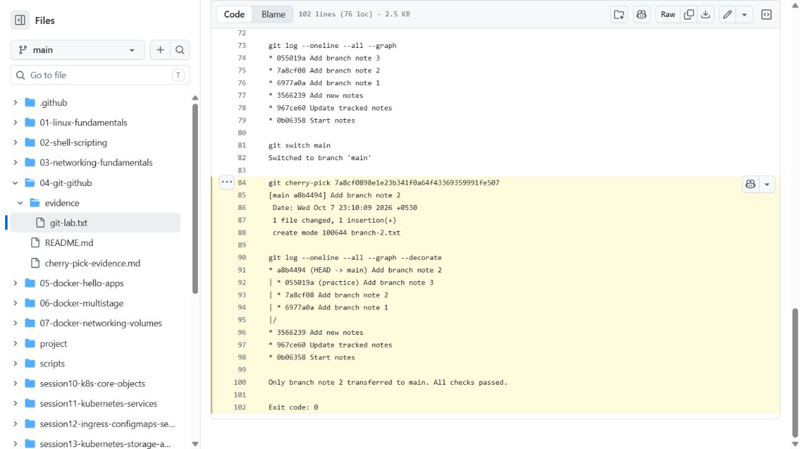

# Git and GitHub Exercises

This folder contains the working notes for the two required exercises. The repository history is the evidence for the commits and cherry-pick.

## `git commit -a -m` versus `git commit -m`

`git commit -m "message"` commits only changes already staged with `git add`. `git commit -a -m "message"` automatically stages modifications and deletions of **tracked** files, but never adds untracked files. Therefore a new file still needs `git add new-file` first.

```bash
git add tracked-file.md
git commit -m "Stage and commit tracked file"

# After changing an existing tracked file:
git commit -a -m "Commit tracked modifications automatically"
```

## Cherry-pick lab

```bash
git log --oneline --all --decorate
git switch -c cherry-pick-lab
# make and commit lab changes
git switch main
git cherry-pick <commit-sha>
git log --oneline --decorate -n 10
```

The `cherry-pick-evidence.md` file is created on the lab branch and then cherry-picked into `main`, demonstrating selective transfer of one commit rather than merging the complete branch.

## Fresh verification

[Real Git transcript](evidence/git-lab.txt) repeats both exercises in an isolated temporary repository without rewriting published history. Main gets three initial commits, the practice branch gets three commits, and only its second commit is cherry-picked. Assertions check that the other two branch-only files are absent from main. The record also shows `-m` refusing unstaged changes and `-am` refusing an untracked file.


