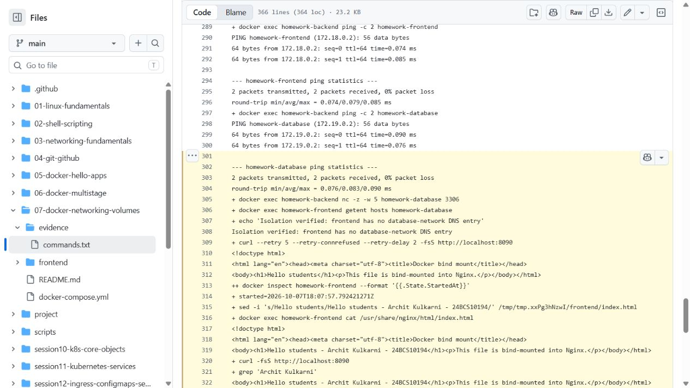

# Docker Networking and Volumes

## Task 1 - three containers and networks

`docker-compose.yml` declares the required frontend (Nginx), backend (Alpine), and database (MySQL) containers. Three named bridge networks are declared. The backend is attached to both `frontend-network` and `backend-network`, allowing it to communicate with the frontend-side and database-side segments while the frontend and database do not share a network.

```bash
docker compose up -d
docker network ls
docker inspect homework-backend --format '{{json .NetworkSettings.Networks}}'
docker exec homework-backend ping -c 2 homework-frontend
docker exec homework-backend ping -c 2 homework-database
docker compose ps
```

Set a disposable password before starting: `export MYSQL_ROOT_PASSWORD="$(openssl rand -hex 16)"`. It is passed to MySQL at runtime, not committed. The automated check uses a disposable copy of this folder and removes only its own lab containers, networks and volume.

The third network, `database-network`, is created to meet the three-network exercise and can be used to attach an additional database client without exposing it to the frontend.

## Task 2 - host networking

On a native Linux Docker host:

```bash
docker pull httpd:2.4-alpine
docker run -d --name apache-host --network host httpd:2.4-alpine
curl http://localhost:80
```

Host networking shares the host network namespace, so Docker ignores `-p` mappings. Docker Desktop's Linux VM differs from a native Linux host; the command is documented for Linux because that is the exercise's intended platform.

## Task 3 - bind mount

The Compose `frontend` service bind-mounts the `frontend` directory into Nginx and publishes it on port 8090. A directory mount also handles editors that replace a file when saving:

```bash
docker compose up -d frontend
curl http://localhost:8090
# Edit frontend/index.html, save it, then run:
curl http://localhost:8090
```

Nginx reads the mounted file directly, so its changed HTML appears without a container restart.

## Task 4 - overlay networks

An overlay network is a Docker Swarm network driver for multi-host workloads. In Swarm mode, Docker distributes network control-plane state, gives services virtual IPs and DNS names, and uses VXLAN encapsulation for traffic between hosts. Overlay networks are appropriate when replicas on separate Docker hosts need private service-to-service connectivity. They require Swarm initialization/joining and network ports between hosts; a regular bridge network is the simpler choice for one host.

Example:

```bash
docker swarm init
docker network create --driver overlay --attachable homework-overlay
docker service create --name web --network homework-overlay nginx:alpine
```

## Cleanup

```bash
docker compose down
docker rm -f apache-host
```

## Executed checks

[check-networking.sh](../scripts/check-networking.sh) starts the three containers, inspects the backend's two networks, pings both peers, checks MySQL's port, and verifies that the frontend cannot resolve the isolated database. It then edits the mounted page to include my name/roll number and checks that the container start time is unchanged. Finally it installs Apache on the Linux host and reaches port 80 from an Alpine container using `--network host`. The [successful live run](https://github.com/archit0k/Devops-HW/actions/runs/37664384256) preserves those checks and cleanup. Overlay networking is a research exercise here, not a claim of a deployed multi-host Swarm.


