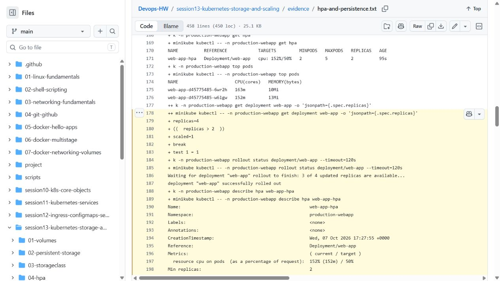

# Session 13 - Storage, Probes, Scaling, and Capstone

Name: Archit Kulkarni  
Roll number: 24BCS10194

## Storage

`01-volumes/` demonstrates `emptyDir` and `hostPath`. `emptyDir` lasts for the lifetime of one Pod, while `hostPath` exposes a node path and should be used carefully. `02-persistent-storage/` adds a PV, PVC, and Pod. `03-storageclass/` requests dynamic provisioning from the default StorageClass.

```bash
kubectl apply -f 02-persistent-storage/pv.yaml -f 02-persistent-storage/pvc.yaml
kubectl get pv,pvc
kubectl apply -f 02-persistent-storage/pod.yaml
```

## Probes and HPA

Readiness decides whether a ready endpoint receives traffic. Liveness restarts an unhealthy container. Startup allows slow applications to initialize before other probes become active. The HPA reads metrics and scales within its configured minimum/maximum range; containers need CPU requests for percentage-based scaling.

```bash
kubectl apply -f 04-hpa/deployment.yaml -f 04-hpa/service.yaml -f 04-hpa/hpa.yaml
kubectl get hpa
kubectl top pods
```

## Production web-app mini project

`mini-project/` deploys a namespace, 500Mi PVC, two-replica Nginx Deployment with startup/readiness/liveness probes, ClusterIP Service, and 2-5 replica HPA.

```bash
kubectl apply -f mini-project/namespace.yaml
kubectl apply -f mini-project/pvc.yaml -f mini-project/deployment.yaml -f mini-project/service.yaml -f mini-project/hpa.yaml
kubectl get all,pvc,hpa -n production-webapp
```

For the persistence check, write `Student: Archit Kulkarni` to `/data/student.txt`, delete the Pod, and read it from the replacement Pod. [run-scaling.sh](run-scaling.sh) performs this check and creates real CPU load to exercise the HPA.

## Results

The [storage/probe command output](evidence/commands.txt) shows `emptyDir` resetting after Pod replacement, `hostPath` retaining the file, a static PV/PVC binding, a dynamically provisioned PVC, and the probe/mini-project resources. The static PVC explicitly names its PV and uses an empty StorageClass so the default dynamic provisioner cannot silently satisfy that test instead.

The [local HPA and persistence record](evidence/hpa-and-persistence.txt) shows the file surviving Pod deletion, metrics-server readings, CPU rising to 152% against a 50% target, and the app scaling from two to five Pods. After the load stopped, CPU fell to 1% and the Deployment returned to two ready Pods. HPA status briefly lagged the Deployment's replica count; the final Pod listing and assertion verify the actual two replicas. The lab namespace was removed afterward.


