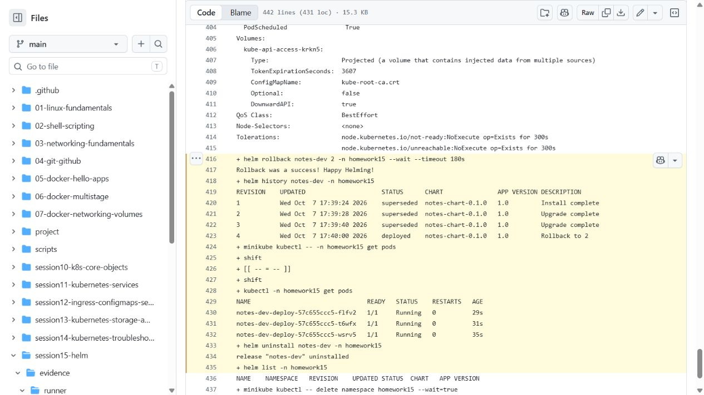

# Session 15 - Helm

Archit Kulkarni | 24BCS10194 | Section A

Helm packages Kubernetes manifests as a chart. Templates are filled using `values.yaml`; a release is one installed instance of that chart.

## Notes app exercise

The chart contains a Deployment, NodePort Service and ConfigMap. Default values run one Nginx 1.24 replica with `ENVIRONMENT=development`. `values-prod.yaml` changes this to three Nginx 1.25 replicas and `ENVIRONMENT=production`.

```bash
helm lint notes-chart
helm template notes-dev notes-chart -n homework15
helm install notes-dev notes-chart -n homework15 --create-namespace --wait
helm list -n homework15
helm status notes-dev -n homework15
helm get values notes-dev -n homework15
helm get manifest notes-dev -n homework15
helm upgrade notes-dev notes-chart -n homework15 -f notes-chart/values-prod.yaml --wait
helm upgrade notes-dev notes-chart -n homework15 -f notes-chart/values-prod.yaml --set image.tag=this-tag-does-not-exist
helm history notes-dev -n homework15
helm rollback notes-dev 2 -n homework15 --wait
helm uninstall notes-dev -n homework15
```

The bad tag is deliberate. `helm upgrade` without `--wait` can report a deployed release even when its new Pod cannot start. Pod status must still be checked. Rolling back to revision 2 restores the working production values and creates revision 4; it does not erase history.

`run-lab.sh` runs the full exercise, including `helm create`, adding/updating the Bitnami repository, `helm search repo`, manifest inspection, Kubernetes checks and cleanup. [Actual local output](evidence/lab.txt) shows install revision 1, upgrade revision 2, bad-image revision 3, rollback revision 4 and an empty release list after uninstall.

`Chart.yaml` describes the chart; `values.yaml` provides defaults; `templates/` contains parameterized resources. A repository indexes downloadable charts. `--set` overrides a value for one command; `-f` loads a values file, which is easier to keep in Git.

The [clean runner recheck](https://github.com/archit0k/Devops-HW/actions/runs/37660532394) also passed; its [full Helm/Kubernetes output](evidence/runner/commands.txt) is saved separately from the local Minikube record.


