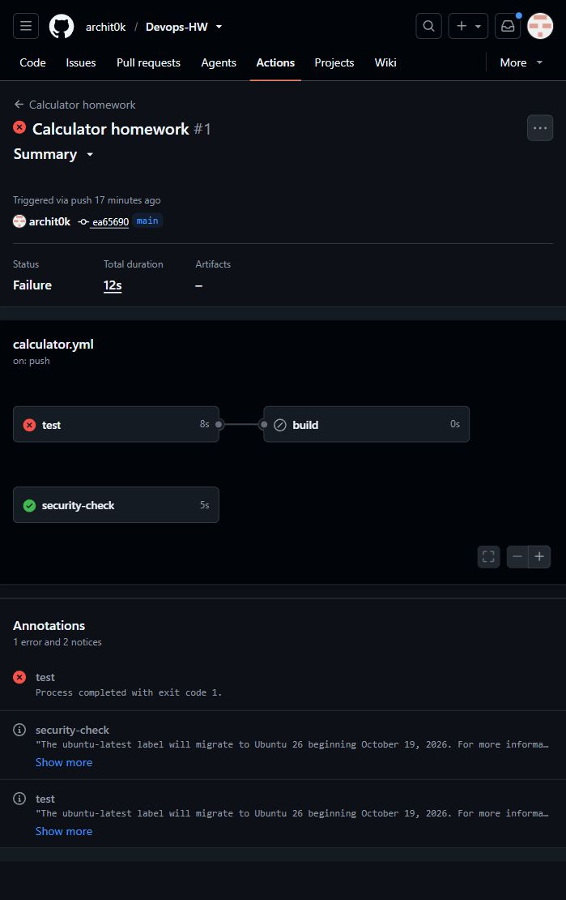
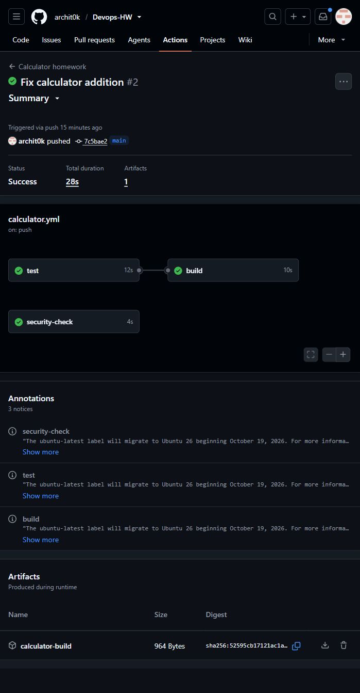

# Session 16 - GitHub Actions

Archit Kulkarni | 24BCS10194 | Section A

This is the calculator build/test exercise from the instructor's material. It has addition, subtraction, multiplication, division and divide-by-zero handling, with five pytest cases.

## Workflow

The [calculator workflow](../.github/workflows/calculator.yml) runs on relevant pushes to `main` or manual dispatch. `test`, `build` and `security-check` are separate jobs. `build` uses `needs: test`, so a failed test prevents packaging. The build artifact contains the calculator module and a small build-info file.

1. The deliberate `a + b + 1` bug produced `assert 16 == 15`: [failed run](https://github.com/archit0k/Devops-HW/actions/runs/37655884909). Four tests passed, one failed, and build was skipped.
2. Addition was corrected to `a + b`: [successful run](https://github.com/archit0k/Devops-HW/actions/runs/37656804648). All five tests passed, all jobs passed, and `calculator-build` was uploaded.





The downloaded [build artifact](evidence/build-artifact/build-info.txt) is also kept with the evidence.

```bash
pip install pytest==9.1.1
pytest -v
bash build.sh
```

An event triggers a workflow; jobs run on runners, and steps within a job execute in order. Separate jobs need explicit dependencies and artifacts to transfer files. `${{ secrets.NAME }}` reads a repository secret, while `${{ github.sha }}` identifies the commit. No personal access key is stored in this exercise.

The simple security job checks for credential files; it is not a replacement for SAST/SCA. The next assignment adds those actual security gates.
