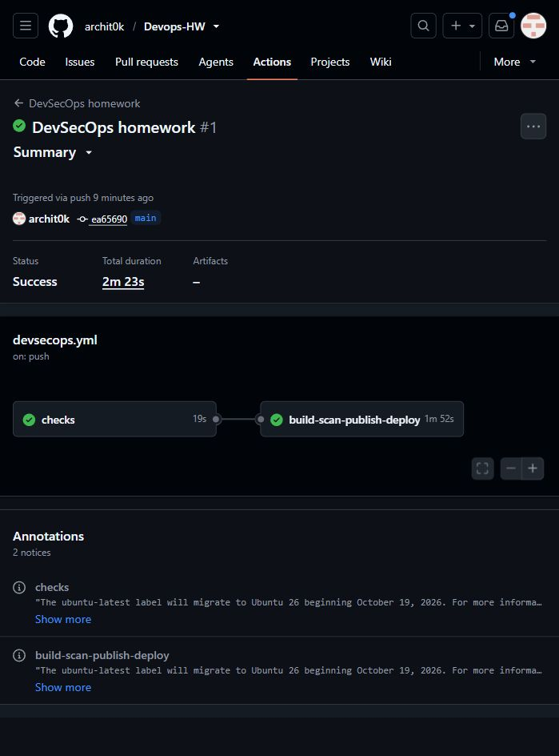

# Session 17 - DevSecOps

Archit Kulkarni | 24BCS10194 | Section A

The small Flask API has a home page, `/health`, greeting endpoint and numeric addition endpoint. Tests cover normal requests, invalid input and missing routes.

## Pipeline and gates

The [workflow](../.github/workflows/devsecops.yml) follows:

```text
pytest -> Bandit -> pip-audit -> Gitleaks
             -> Docker build -> Trivy -> GHCR push
             -> real Kubernetes rollout -> HTTP smoke test
```

Every gate must pass before publication/deployment. Trivy exits nonzero for HIGH or CRITICAL vulnerabilities; there is no CVE ignore list. The image runs as UID 10001, and the Deployment adds probes, resource limits and restricted container settings.

The [successful run](https://github.com/archit0k/Devops-HW/actions/runs/37655885319) passed eight tests, SAST, dependency audit, full-history secret scan, image scan, registry publication and actual deployment to a disposable kind cluster. The `/health` request returned the name and roll number. The cluster was deleted after verification.



```bash
pip install -r requirements-dev.txt
pytest -v
bandit -r app.py -c security/bandit.yaml -ll
pip-audit -r requirements.txt
docker build -t homework-api:local .
kubectl apply -f kubernetes/deployment.yaml
kubectl set image deployment/homework-api app=<the-tested-image-tag>
kubectl rollout status deployment/homework-api
```

The manifest image `homework-api:ci` is replaced with the exact tested commit-SHA tag by the workflow. It is not a claim that a public mutable `latest` tag was deployed. Publishing uses GitHub's short-lived workflow token, not AWS keys or a stored personal token.

[Security notes](security/README.md) explain what each scanner covers and the narrowly documented historical teaching-value fingerprints in `.gitleaksignore`. Flask's development server is sufficient for this classroom API, not a production serving recommendation.
