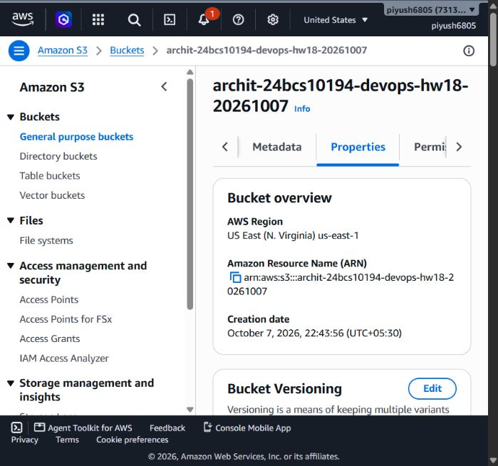

# Session 18 - Terraform and Infrastructure as Code

Archit Kulkarni | 24BCS10194 | Section A

The [S3 demo](terraform-s3-demo/) defines a private, encrypted bucket in `us-east-1`. Bucket name/region come from variables and `terraform.tfvars`; outputs show the name, ARN and region. This file contains no credentials.

## Terraform workflow

```bash
cd terraform-s3-demo
terraform init
terraform fmt -check
terraform validate
terraform plan -out=lab.tfplan
terraform apply lab.tfplan
terraform show
terraform output
terraform destroy
```

`init` installs providers and prepares the backend; `fmt` formats HCL; `validate` checks structure; `plan` compares configuration/state with remote resources; `apply` performs the reviewed changes. State maps Terraform addresses to real resource IDs. `destroy` plans their removal using that state.

Terraform resolves references into a dependency graph, so the public-access block and encryption settings depend on the bucket without manual command ordering. Providers translate resource operations into AWS API calls. Variables are inputs, outputs expose selected results, and state is not the same thing as source code.

The real AWS bucket was created on 7 October. [Evidence](evidence/) contains validation, plan/apply, inspection, outputs and cleanup records. State, saved plans and authentication material are ignored by Git.



## AWS research notes

| Service | Notes |
| --- | --- |
| IAM | [Users, roles, policies and least privilege](aws-iam/README.md) |
| EC2 | [Instances, AMIs, storage and networking](aws-ec2/README.md) |
| S3 | [Buckets, objects, protection and storage classes](aws-s3/README.md) |
| VPC | [Subnets, routing and network controls](aws-vpc/README.md) |
| DynamoDB / RDS | [NoSQL and relational database comparison](aws-databases/README.md) |

Infrastructure code is repeatable and reviewable, but `apply` is not automatically safe. Always check the account, region, state location and proposed changes. Local state can contain sensitive values, even when terminal output labels them sensitive; keep it private.
