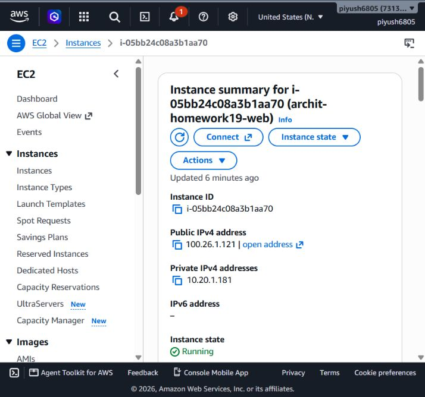
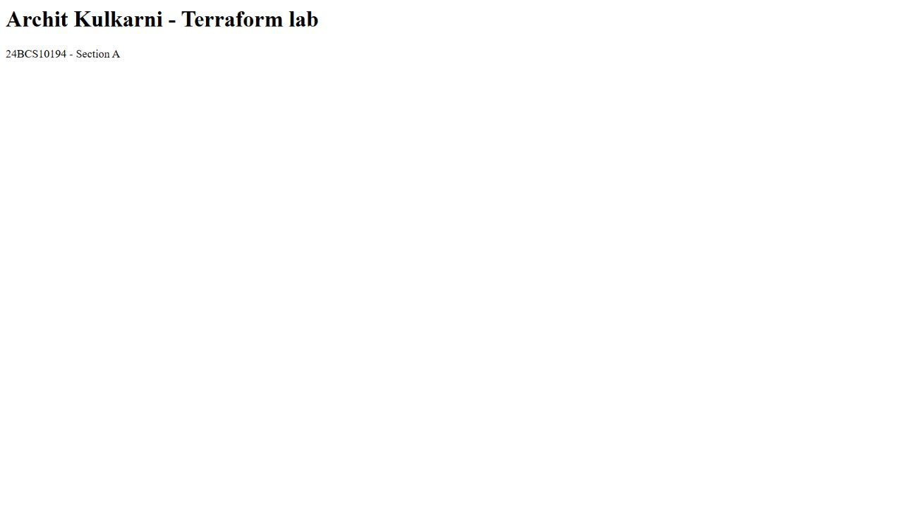
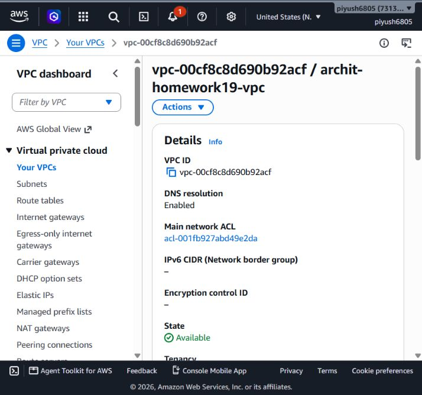

# Session 19 - Cloud and Terraform

Archit Kulkarni | 24BCS10194 | Section A

This extends the instructor's VPC mini project with an actual EC2 web server and private S3 bucket.

```text
Internet -> Internet Gateway -> public route table
                                  |
                         subnet 10.20.1.0/24
                         in VPC 10.20.0.0/16
                                  |
                         Security Group: TCP 80
                                  |
                       t3.micro + encrypted gp3

Private S3 bucket (separate regional AWS service)
```

## What is configured

The subnet is public because its associated route table sends `0.0.0.0/0` to the Internet Gateway. The instance also needs its public IPv4 address and an inbound HTTP Security Group rule. No SSH port or key pair is opened. IMDSv2 is required. User data installs Apache and serves a page with my name, roll number and section.

The configuration uses the Amazon Linux 2023 AMI published through SSM rather than a hardcoded old AMI. Availability Zone data selects a real AZ in the chosen region. The bucket blocks all four public-access paths. Standard CPU credits avoid unlimited-mode burst charges in this short lab.

```bash
terraform init
terraform fmt -check
terraform validate
terraform plan -out=lab.tfplan
terraform apply lab.tfplan
terraform output
curl "$(terraform output -raw web_url)"
terraform destroy
```

The files separate provider setup, resources, inputs and outputs. The dependency on the public route association makes networking available before instance provisioning. [Evidence](evidence/) records the actual operations and resource IDs, including any retry caused by local DNS trouble.







The [destroy record](evidence/destroy.txt) confirms all nine managed resources were removed. The saved public URL is historical evidence, not a permanently hosted site.

## Cloud concepts

IaaS supplies compute/network/storage while the customer manages OS and application (EC2). PaaS handles more of the platform so the customer focuses on application code. SaaS supplies the finished application. Responsibility shifts with the service model, but customer data, identity and access choices remain important.

A Region is a geographical AWS area; Availability Zones are isolated locations within it. Multi-AZ placement improves resilience. A subnet belongs to one AZ, while a VPC spans the Region. Security Groups are stateful allow rules on network interfaces; NACLs are stateless subnet controls with allow/deny rules, so return ports need explicit consideration.

This was a temporary exercise: there is no NAT Gateway, EKS cluster, database service or managed load balancer. The public page contains only the classroom identification, and resources are removed after evidence capture.
