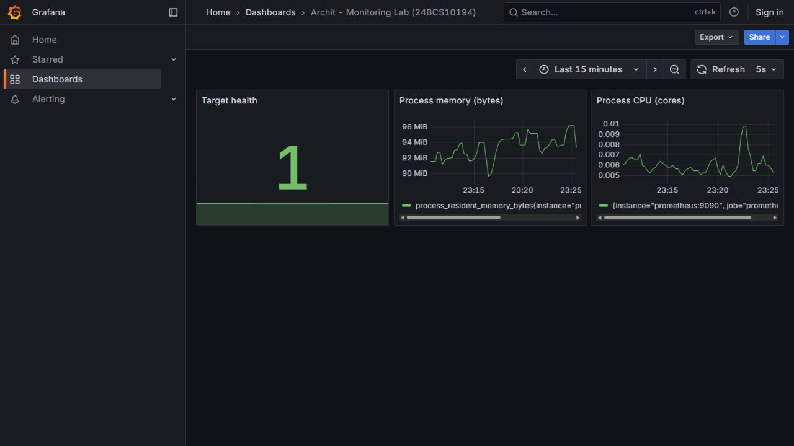

# Session 20 - Monitoring, Observability and GitOps

Archit Kulkarni | 24BCS10194 | Section A

## Prometheus and Grafana

The [Compose setup](monitoring/compose.yaml) runs the instructor's Prometheus 3.5.0 and Grafana 12.1.1 images. Prometheus scrapes itself and Grafana every five seconds. Grafana's provisioned Prometheus data source connects through the Compose service name, not the laptop's `localhost`.

```bash
docker compose -f monitoring/compose.yaml up -d
docker compose -f monitoring/compose.yaml ps
curl 'http://localhost:9090/api/v1/query?query=up'
docker compose -f monitoring/compose.yaml logs --tail=15
docker compose -f monitoring/compose.yaml down
```

The dashboard shows target health (`up`), process memory and process CPU rate. These are Prometheus-process metrics, not a claim to monitor every laptop process. Both ports bind only to `127.0.0.1`. The classroom dashboard has anonymous **read-only** viewing, no user data, and no public exposure. [The alert rule](monitoring/alerts.yml) defines `TargetDown` for a target unreachable for ten seconds.



[Monitoring API/health/log output](evidence/monitoring.txt) and the [alert test](evidence/alert.txt) record the real values. The alert test stops Grafana, waits for `TargetDown` to enter `firing`, restarts Grafana and checks recovery. This intentionally tests a scrape failure, not an invented production incident.

## GitOps mini project

`app/` contains the namespace, Nginx Deployment and Service. The [Argo CD Application](argocd-application.yaml) stays **outside** that watched directory and points to this repository's real `main` branch.

1. Commit `f68b99b` defined two replicas. Argo CD read Git and created them in namespace `homework20`.
2. Commit `d7ec068` changed the Git manifest to three replicas. Argo CD automatically applied that change.
3. The lab ran `kubectl scale ... --replicas=1`. Git still specified three, so Argo CD self-healed back to three. Rollout and HTTP checks then passed.
4. The Application and the runner's disposable kind cluster were removed.

The [actual GitOps run](https://github.com/archit0k/Devops-HW/actions/runs/37657659611) and [command transcript](evidence/commands.txt) preserve the initial two, Git-driven three, manual one and restored three. This cluster ran on a GitHub-hosted runner; the monitoring dashboard ran locally in Ubuntu WSL. `run-gitops.sh` needs a commit change during its demonstration, so rerunning it against the final three-replica manifest requires restoring two first in Git.

## Viva notes

1. Monitoring checks known signals/conditions; observability lets me investigate why an unexpected problem happened using system outputs.
2. Metrics are numerical time series, logs are event records, and traces follow a request through multiple components. A trace/span ID can connect these views.
3. Prometheus pulls metrics, stores time series and evaluates PromQL/rules.
4. Grafana visualizes data from sources such as Prometheus; it is not the metrics database here.
5. GitOps uses versioned desired state and a reconciler to apply it.
6. Git is the source of truth because reviewed commits define what should run and preserve change history.
7. Argo CD compares Git manifests with the cluster and synchronizes differences.
8. Desired state is the Git specification, such as three replicas.
9. Actual state is what Kubernetes currently has, such as one replica after a manual change.
10. Reconciliation compares the two and moves actual state toward desired state.
11. Self-healing restores manual cluster drift when enabled. It is not the same as a Deployment replacing one failed Pod.
12. Changing two to three in Git causes Argo CD to update the Deployment; Kubernetes creates the additional Pod.

For an incident I would check target health first, then CPU/memory/request latency, application logs and traces. The mini project produces real Nginx access logs; distributed tracing here is research, not an unimplemented claim of a trace backend.
