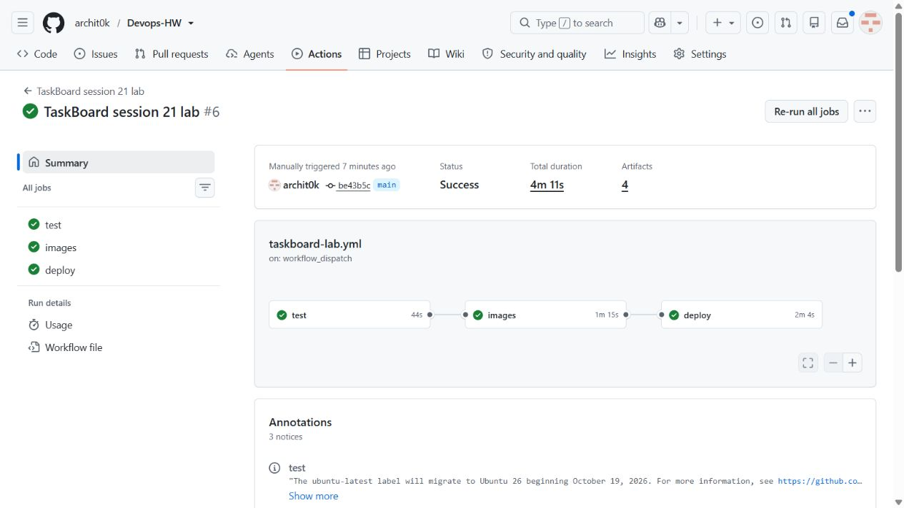
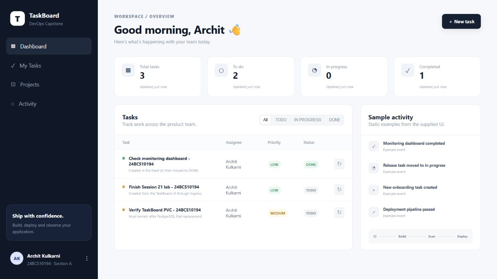
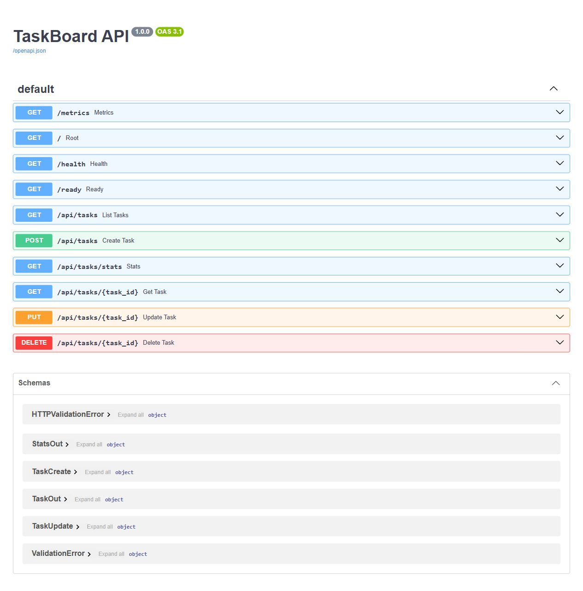
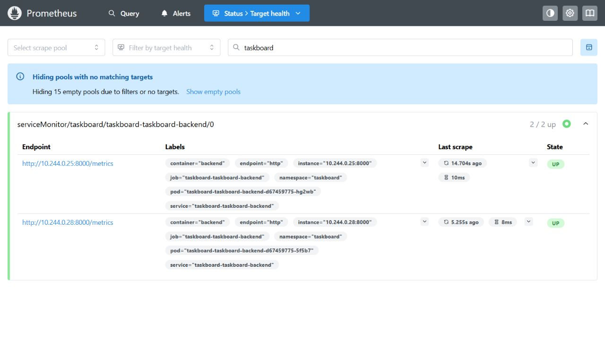
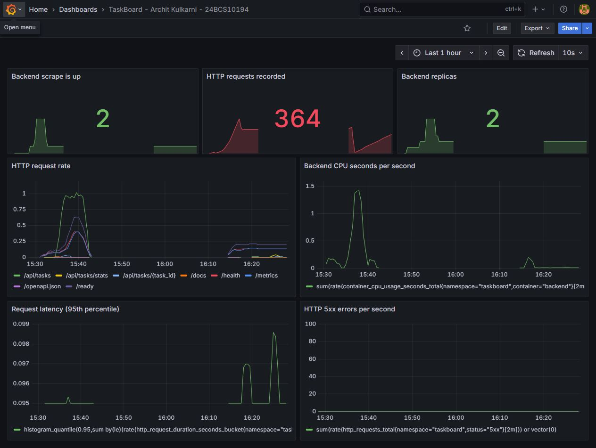
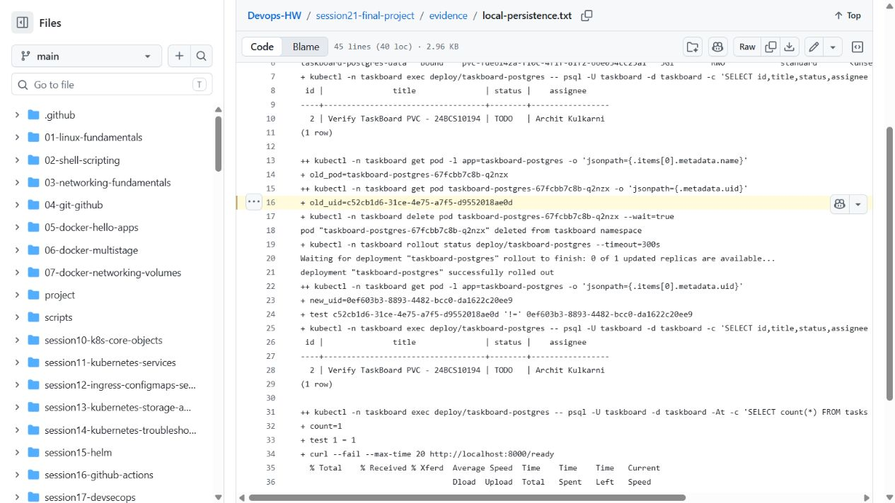
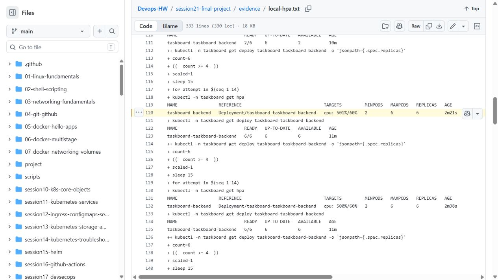
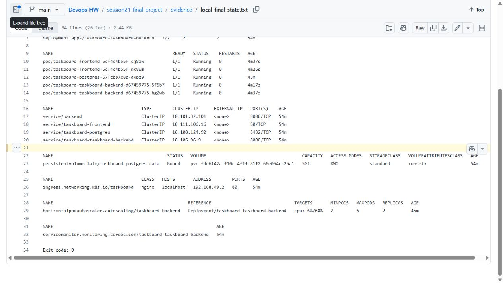

# Session 21 - TaskBoard walkthrough and troubleshooting

Archit Kulkarni | 24BCS10194 | Section A

This assignment executes the instructor's [Session 21 TaskBoard README](https://github.com/Nency-Ravaliya/devops-heros/blob/main/session21-python/README.md). The separate student project is [StudySlot](../project/README.md), not this exercise.

## What I ran

The instructor's TaskBoard source is in [taskboard](taskboard/). This is the supplied React + FastAPI + PostgreSQL lab, not my original project. The old folder name is kept so the submitted README link does not change.

Checked on 8 October 2026. The [latest GitHub Actions run](https://github.com/archit0k/Devops-HW/actions/runs/37766328521) passed all three stages: test, images and deploy, using commit `be43b5c6c0a627713132ca8fab8e86318b4d17a4`. It ran the direct backend check, three Pytest tests, frontend build, Compose CRUD checks, both image scans, GHCR publishing and a Helm deployment on a disposable Kubernetes cluster.

The browser, Ingress, PVC, HPA, monitoring and troubleshooting checks ran separately on local Minikube, as supported by the instructor's classroom walkthrough. This is not evidence of an AWS application deployment. The earlier local Compose DNS failure and AWS access failure are kept separate from the successful checks.



| Walkthrough | Commands/checks | Result and record |
| --- | --- | --- |
| Docker Compose | `docker compose up --build -d`, `ps`, health/ready/docs/metrics requests, frontend and CRUD, `docker compose down` | Passed on the CI runner. Three services ran; backend ran as UID 10001. [Full output](evidence/run-be43b5c/compose.txt) |
| Direct backend | `python -m venv .venv`, install requirements, `alembic upgrade head`, `alembic current`, `uvicorn app.main:app` | Passed on the runner with a separate PostgreSQL container. Health, tasks and Swagger returned HTTP 200; creating a task returned 201. [Full output](evidence/direct-be43b5c/direct-backend.txt) |
| Database | `psql ... SELECT id,title,status,assignee FROM tasks;` | The inserted row belonged to Archit Kulkarni. Compose also verified an update to DONE and deletion. Both records above contain the actual SQL output. |
| Pytest and frontend | `pytest -q`, `npm ci`, `npm run build` | Three tests passed; frontend production build passed. [Test job](https://github.com/archit0k/Devops-HW/actions/runs/37766328521/job/113274789900) |
| Git/GitHub | Existing repository, `git add`, `git commit`, `git push origin main` | Changes are on `main`. I kept the existing history and remote rather than reinitialising the repository or adding a second origin. |
| Docker images | Compose built both Dockerfiles; images tagged with the tested commit SHA | Backend and frontend images built successfully. [Image job](https://github.com/archit0k/Devops-HW/actions/runs/37766328521/job/113275068865) |
| Trivy gate | `trivy image --scanners vuln --severity HIGH,CRITICAL --exit-code 1` on both images | Both passed with zero HIGH/CRITICAL findings at scan time. [Backend](evidence/run-be43b5c/backend-scan.txt), [frontend](evidence/run-be43b5c/frontend-scan.txt) |
| Registry | `docker push ghcr.io/archit0k/taskboard-{backend,frontend}:<tested-sha>` | Both tested SHA tags were pushed by CI. No AWS credentials were given to GitHub Actions. |
| Terraform | `init`, `fmt`, `validate`, `plan` | Init and validation passed; the new plan proposed 66 additions including Metrics Server. [Init](evidence/terraform-init.txt), [latest validation](evidence/terraform-validate-complete.txt), [successful plan](evidence/terraform-plan-complete.txt) |
| AWS apply | `terraform apply lab.tfplan` | Passed: 66 resources added, including EKS 1.35, two managed worker nodes, EBS CSI and Metrics Server. [Apply output](evidence/terraform-apply-complete.txt), [console screenshot](evidence/eks-active.jpg) |
| CI Kubernetes deployment | Namespace, Secret, `helm upgrade --install`, Deployments, Services, PostgreSQL PVC and API checks | Passed on the runner's Kubernetes 1.35 cluster using the exact scanned images. All three app Pods became Ready; PVC was Bound; a task was created, read and deleted through the actual API. Helm release and namespace were removed. [Output](evidence/deploy-be43b5c/kubernetes.txt), [deploy job](https://github.com/archit0k/Devops-HW/actions/runs/37766328521/job/113275537053) |
| AWS Kubernetes access | Configure kubeconfig, then check nodes | Not verified: AWS rejected root assuming the lab role. No successful AWS application deployment is claimed. [Actual failure](evidence/eks-deployment.txt) |
| AWS cleanup | `terraform destroy -auto-approve` | Passed: 66 resources destroyed, exit code 0. [Latest cleanup](evidence/terraform-destroy-access-pause.txt). The earlier partial run's [49-resource cleanup](evidence/terraform-destroy.txt) is preserved separately. |
| Access preflight | `terraform plan` without a non-root principal | Expected rejection, exit code 1: the new guard prevents another root-only access setup from provisioning. This check was plan-only; it created nothing. [Guard output](evidence/root-access-guard.txt) |
| Local Kubernetes / Helm | Namespace and Secrets, `helm lint`, `helm upgrade --install`, `get` objects, `helm list`, `id` | Passed on Minikube 1.37 with the matching kubectl. Backend UID 10001; PostgreSQL PVC Bound. [Installation](evidence/local-deployment.txt), [final objects](evidence/local-final-state.txt), [frontend update](evidence/local-ui-update.txt) |
| Ingress and application | Dev values, controller, frontend `/` and backend `/api`, browser task creation and status changes | Passed through the real Nginx Ingress. Host overridden to `localhost`, avoiding a hosts-file change. The browser created a task and moved it to DONE. [API checks](evidence/local-final-api.txt), [SQL rows](evidence/local-tasks.txt), [app screenshot](evidence/taskboard-app.jpg) |
| Swagger CRUD | Execute POST, GET by ID, PUT and DELETE in `/docs` | Actual browser requests returned 201, 200, 200 and 204 respectively. The temporary Swagger task was deleted. Screenshots below show the responses. |
| PostgreSQL persistence | Query tasks, delete PostgreSQL Pod, wait for its replacement, query again | Passed: the Pod UID changed, the same 5 GiB PVC stayed Bound and Archit's task survived. [Before/after output](evidence/local-persistence.txt) |
| HPA | CPU requests, Metrics Server, HPA target 60%, bounded CPU load and recovery | Passed: 2 → 6 ready backend Pods → 3 → 2. Peak recorded utilization was about 501%. The final check confirms 2 replicas again. [Scaling record](evidence/local-hpa.txt), [final state](evidence/local-final-state.txt) |
| Prometheus / Grafana | ServiceMonitor, real requests, target inspection, PromQL samples and dashboard | Passed: 2/2 backend targets UP, 452 observed requests at the final check, 2 available replicas, p95 0.095 seconds and 5xx rate 0. The dashboard includes CPU and request-rate graphs. [Traffic](evidence/local-http-load.txt), [final metrics](evidence/local-monitoring-ready.txt), screenshots below |
| Broken image | Apply supplied manifest, inspect Pod/events, fix image/config and check readiness | Reproduced ErrImagePull/ImagePullBackOff for the supplied nonexistent GHCR image. The corrected Deployment became Ready and `/ready` returned READY. [Full before/after record](evidence/local-troubleshooting.txt) |
| Broken Service | Apply supplied manifest, inspect selector/labels/endpoints, fix selector and target port | Reproduced empty endpoints. The fix selected backend Pods and routed Service port 8080 to container port 8000; three endpoints appeared and `/health` returned UP. Both temporary broken resources were removed. [Full record](evidence/local-troubleshooting.txt) |

The HPA status briefly lagged behind the Deployment during downscaling; the later final-state record confirms both at two replicas. The failed image-load and interrupted port-forward attempts are preserved in the evidence folder, but are not used as passing results.

## Browser screenshots

These are captures of the running lab, not generated mockups. The supplied activity panel is labelled as static sample content; the task table, API responses and monitoring samples are real.





Swagger requests: [create — 201](evidence/swagger-create.jpg), [read — 200](evidence/swagger-read.jpg), [update to DONE — 200](evidence/swagger-update.jpg), [delete — 204](evidence/swagger-delete.jpg).





## Saved command-output screenshots

These screenshots show the published, unedited execution records on GitHub after the lab. They are not live terminal captures. The full text records linked in the table contain the commands, timestamps and exit codes.







Broken image: [failure and events](evidence/troubleshooting-image-before.jpg), [Ready replacement and successful readiness request](evidence/troubleshooting-image-after.jpg).

Broken Service: [empty endpoints, labels and selector/port correction](evidence/troubleshooting-service-before.jpg), [populated endpoints, health response and cleanup](evidence/troubleshooting-service-after.jpg).

## Re-running the completed checks

From the repository root on Linux/WSL:

```bash
bash session21-final-project/run-compose.sh
bash session21-final-project/run-backend.sh
```

[Compose helper](run-compose.sh) creates a temporary password without printing it, waits for readiness, checks the real API and database, and stops the services on exit. [Direct-backend helper](run-backend.sh) uses a fresh virtual environment, PostgreSQL on loopback port 15433 and Uvicorn on port 8000, then removes its test-only PostgreSQL container. Run them one at a time because both use port 8000. Removing a Compose volume with `docker compose down -v` also removes its test database; it is not needed just to stop the services.

The latest pipeline built, scanned, published and deployed both images with this SHA:

```text
ghcr.io/archit0k/taskboard-backend:be43b5c6c0a627713132ca8fab8e86318b4d17a4
ghcr.io/archit0k/taskboard-frontend:be43b5c6c0a627713132ca8fab8e86318b4d17a4
```

The final local lab used backend `09c8dec70b4652578823881ce4c51e73bfd945a4` from the earlier passing CI artifact, and frontend `be43b5c6c0a627713132ca8fab8e86318b4d17a4` built locally from that committed source using the original multi-stage Dockerfile. The helper defaults match this pair. Earlier persistence/HPA/troubleshooting records used the already-tested `25ef8e537db59c165ce4e9fe8f6d4c2e1d4e787f` pair; the later API and monitoring checks ran after the updates. Each record keeps its actual image tag.

To repeat the classroom demo with Docker Engine running and those images available locally:

```bash
bash session21-final-project/prepare-local-cluster.sh
bash session21-final-project/run-local.sh
bash session21-final-project/forward-local.sh
```

Leave the forwarding helper running in one terminal. In another, from the repository root:

```bash
python3 session21-final-project/check-api.py
bash session21-final-project/run-persistence.sh
bash session21-final-project/run-hpa.sh
python3 session21-final-project/generate-traffic.py
python3 session21-final-project/check-monitoring.py
bash session21-final-project/run-troubleshooting.sh
```

The loopback URLs are `http://localhost:3000` (Ingress), `http://localhost:8000/docs` (Swagger), `http://localhost:9090/targets` (Prometheus) and `http://localhost:3001` (Grafana). Grafana uses the runtime `taskboard-grafana` Secret, not a password saved in this repository. The monitoring chart is pinned to 89.2.0 and the local Grafana image to the working 12.1.1 version. `TASKBOARD_TAG` and `TASKBOARD_FRONTEND_TAG` can select other built/pulled SHA tags.

[Cleanup](cleanup-local.sh) first prints a data-only SQL dump, then removes only the TaskBoard and monitoring releases/namespaces and stops Minikube. This removes the temporary classroom database PVC, so save the dump before using it if any data is needed. The actual three-row dump is in [the cleanup record](evidence/local-cleanup.txt). The reusable cluster and cached images are retained.

## Fixes needed for the walkthrough

- The supplied backend tests needed the `TestClient` startup context so the test table was created. The application is still the instructor's TaskBoard.
- The first security gate failed on vulnerable Python dependencies. I updated the affected dependencies and removed build-only pip tooling from the runtime image. The gate stayed enabled; no vulnerability was suppressed. [First backend scan](evidence/first-run/backend-scan.txt), [failed run](https://github.com/archit0k/Devops-HW/actions/runs/37668813204).
- Compose's PostgreSQL host port is 15432 to avoid an existing port 5432 service. Container-to-container connections still use 5432.
- The frontend proxy expects `backend:8000`. The Helm chart now provides that Service alias; the Ingress references the chart's actual backend Service name and port, 8000.
- Database credentials come from an existing Kubernetes Secret, not a committed password. Both application Deployments accept image-pull secrets if needed.
- PostgreSQL uses `PGDATA` below the mounted volume directory, so EBS's `lost+found` does not break database initialization. `Recreate` avoids two PostgreSQL Pods trying to write to the same single-writer PVC during an update.
- The backend waits for an authenticated database query before starting. A startup probe gives migrations time to finish instead of repeatedly restarting the Pod.
- The supplied create-task handler accessed `e.currentTarget` after `await`, when it had become null. Keeping the form reference before the request fixes the modal/reset issue. Create/update requests now also check unsuccessful HTTP responses. The rebuilt UI was tested in the browser.
- The monitoring chart's Grafana image did not load its Prometheus data-source plugin locally. The lab values pin the verified 12.1.1 image and give Grafana sufficient CPU/memory. Both target checks and the rendered dashboard then passed; an empty dashboard was not counted as verification.
- The Terraform HCL was formatted into valid module blocks. EKS uses a supported Kubernetes version, AL2023 nodes, EBS CSI and Metrics Server. The attempted access role did not work with AWS root: root cannot assume roles. Non-root lab access needs approval before another cloud deployment attempt. No AWS credentials were stored in GitHub Actions.
- CI deploys the exact scanned SHA images on an isolated Kind cluster. This tests the deploy stage without leaving a cloud cluster running or giving the runner AWS account access. EKS application verification remains separate.

## Notes from the walkthrough

Git tracks changes locally; GitHub hosts the remote repository and pipeline. A commit is a checkpoint, a branch keeps a line of work separate, and a pull request is a way to review changes before merging. I used the existing homework repository rather than creating another one for TaskBoard.

Pytest runs before image publishing so a failing test stops promotion. The frontend's multi-stage Dockerfile leaves Node build tools out of the Nginx runtime. The backend runs as a non-root user; readiness checks the database, while liveness checks the application process. A Service keeps a stable address even when a Deployment replaces Pods. An Ingress needs a running controller to turn its routing rules into working HTTP requests.

In Helm, the chart is the package, templates generate manifests, values supply settings and a release is an installed instance. `upgrade --install` creates or updates that release; rollback restores a previous release revision. The local values enable Ingress without changing the shared chart. CPU requests provide the denominator for HPA utilization, and Metrics Server supplies the measurements; Prometheus is not the HPA's metrics provider in this setup.

A PVC keeps PostgreSQL data outside the lifetime of one Pod, but it is not a backup or a highly available database. In production I would consider RDS for managed backups, patching and Multi-AZ operation. An in-cluster database gives more control but also leaves those jobs, restore testing and failover to the operator. The classroom uses PostgreSQL with a PVC; no RDS instance was provisioned.

Trivy's image/dependency findings are only one security layer. SAST checks source patterns, secret scanning looks for exposed credentials, container scanning checks the packaged software, and runtime controls deal with a running workload. Passing the HIGH/CRITICAL gate is a result at scan time, not a guarantee that the application has no vulnerabilities.

Prometheus scrapes `/metrics` through the ServiceMonitor and stores time series. Grafana reads those series: request rate shows traffic, p95 latency highlights slow requests, 5xx rate shows server errors, CPU shows workload pressure and the replica metric shows scaling. These are actual observations only once the scrape target is UP and samples exist.

## Completion and cleanup

The classroom TaskBoard walkthrough is recorded, including the previously pending checks. Terraform's AWS apply/destroy and the three-stage pipeline also passed. AWS application access is the one separate limitation: root could not assume the lab role, so there is no successful EKS application deployment claim. No new IAM user or access key was created. The instructor permits the classroom Kubernetes/PostgreSQL-PVC demo locally, which is what the browser and cluster evidence show.

The earlier local attempt that selected the AWS credential context is preserved in [its failure record](evidence/local-cluster-ready.txt). The helpers now explicitly select Minikube and refuse unrelated contexts. StudySlot remains paused and unchanged in [project](../project/README.md).

Nothing has been submitted by this repository workflow.

The cloud lab was destroyed. The [final read-only check](evidence/final-pause-check.txt) found no EKS clusters, non-terminated EC2 instances, EBS volumes, active NAT gateways, Elastic IP allocations or tagged TaskBoard VPC/ECR repositories in `ap-south-1` and `us-east-1`; the S3 bucket list was also empty. It confirmed Minikube was stopped and no Docker containers were running. The previous [AWS access pause check](evidence/access-pause-check.txt) and [earlier pause check](evidence/pause-check.txt) are retained, including the KMS `PendingDeletion` status. No new cloud resources were provisioned for this local walkthrough. Windows DNS was not changed; Ubuntu uses its original WSL resolver.

[Local cleanup](evidence/local-cleanup.txt) removed the temporary TaskBoard database PVC after saving its three-row SQL dump, and removed the monitoring release. The source, dump, test records, reusable Minikube cluster and cached images remain. [Docker and containerd were then stopped](evidence/local-services-final.txt); the lab's loopback forwarding processes were also stopped. The project was not started or changed.

[Local README link check](evidence/readme-link-check.txt).
