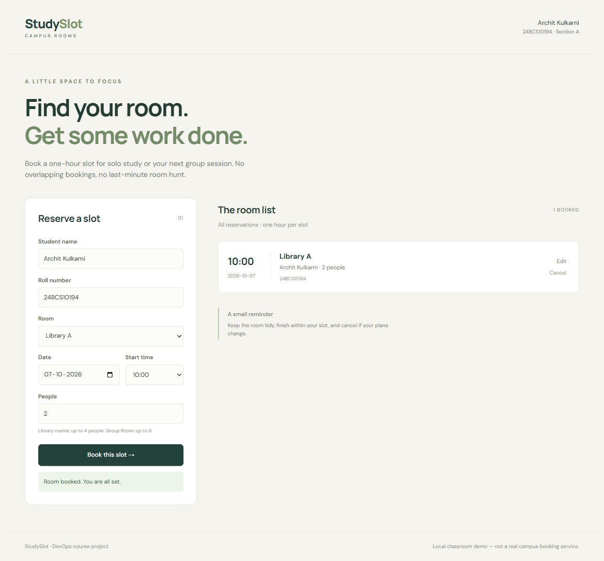

# StudySlot — final DevOps project

Archit Kulkarni · 24BCS10194 · Section A

I picked a study-room booking app instead of copying the TaskBoard example. A student can reserve a one-hour slot, change it, or cancel it. The database prevents two people booking the same room at the same time, including concurrent requests. This is a classroom demo, not an official campus service; it has no login or access control and must not be used with real private bookings.

```text
Browser → Nginx/React → FastAPI → PostgreSQL
                        └→ /metrics → Prometheus → Grafana
GitHub → tests + security gates → SHA-tagged GHCR images → Helm/Kubernetes
Terraform → AWS VPC + EKS       Git → Argo CD reconciliation
```

## Application

`backend/app/` has the API, models and validation. `backend/alembic/versions/001_bookings.py` creates the table. `/health` checks the process; `/ready` checks the database. CRUD routes are `GET/POST /api/bookings` and `GET/PUT/DELETE /api/bookings/{id}`. `/api/rooms` lists room capacities. `/metrics` exposes request counts and latency. Logs contain a request ID, route, status and duration, not submitted student details.

```bash
cd backend
python -m venv .venv
source .venv/bin/activate
pip install -r requirements-dev.txt
alembic upgrade head
pytest -v
uvicorn app.main:app --host 127.0.0.1 --port 8000
```

The development default is SQLite. Compose and Kubernetes use PostgreSQL. Tests override the database with a fresh in-memory SQLite database per test, so a test cannot delete production data.

## Docker

Copy `.env.example` to ignored `.env` and set a local password. Then run `docker compose up --build -d`. Open `http://localhost:3000`. The one-shot migration service finishes before the backend starts. Backend and frontend run as non-root users; the frontend has a Node build stage and an Nginx runtime stage. PostgreSQL stays on the private network and has a named volume.

`docker compose down` preserves the database. Only use `down -v` when intentionally discarding this demo's data.

## Verification status

This project is paused while the assignments due today are submitted. It is not a completed final-project submission. The API, frontend, containers, CI/security checks and infrastructure files are present; the final AWS/Kubernetes/GitOps deployment and remaining project evidence are still pending.

Recorded checks include [API tests](evidence/pytest.txt), [Compose health/status](evidence/compose-status.txt) and the [passing CI run](https://github.com/archit0k/Devops-HW/actions/runs/37654467610). These are historical checks, not a claim that a project EKS cluster is running.



The instructor's [rubric](https://github.com/Nency-Ravaliya/devops-heros/blob/main/session21-python/GRADING.md) is the checklist for the remaining work.
