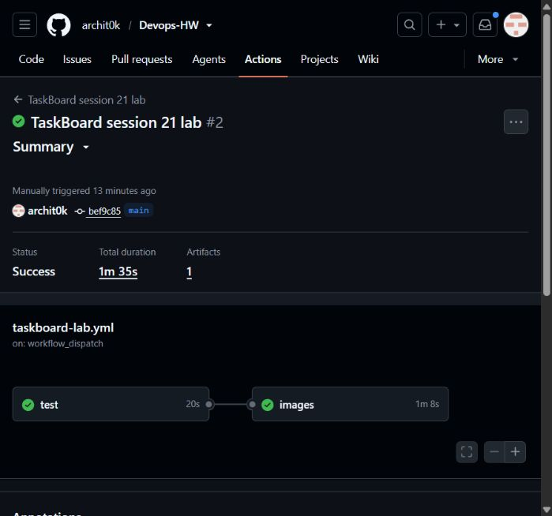

# Session 21 - TaskBoard walkthrough and troubleshooting

Archit Kulkarni | 24BCS10194 | Section A

This assignment executes the instructor's [Session 21 TaskBoard README](https://github.com/Nency-Ravaliya/devops-heros/blob/main/session21-python/README.md). The separate student project is [StudySlot](../project/README.md), not this exercise.

## What I ran

The instructor's TaskBoard source is in [taskboard](taskboard/). This is the supplied React + FastAPI + PostgreSQL lab, not my original project. The old folder name is kept so the submitted README link does not change.

Verified on 8 October 2026. The [latest GitHub Actions run](https://github.com/archit0k/Devops-HW/actions/runs/37671110941) passed the direct backend check, three Pytest tests, frontend build, Compose CRUD checks, both image scans and GHCR publishing. Local Compose builds hit a DNS error; the successful execution below is on the GitHub-hosted Ubuntu runner.



| Walkthrough | Commands/checks | Result and record |
| --- | --- | --- |
| Docker Compose | `docker compose up --build -d`, `ps`, health/ready/docs/metrics requests, frontend and CRUD, `docker compose down` | Passed. Three services ran; backend ran as UID 10001. [Full output](evidence/latest-run/compose.txt) |
| Direct backend | `python -m venv .venv`, install requirements, `alembic upgrade head`, `alembic current`, `uvicorn app.main:app` | Passed with a separate PostgreSQL container. Health, tasks and Swagger returned HTTP 200; creating a task returned 201. [Full output](evidence/direct-run/direct-backend.txt) |
| Database | `psql ... SELECT id,title,status,assignee FROM tasks;` | The inserted row belonged to Archit Kulkarni. Compose also verified an update to DONE and deletion. Both records above contain the actual SQL output. |
| Pytest and frontend | `pytest -q`, `npm ci`, `npm run build` | Three tests passed; frontend production build passed. [Test job](https://github.com/archit0k/Devops-HW/actions/runs/37671110941/job/112962813024) |
| Git/GitHub | Existing repository, `git add`, `git commit`, `git push origin main` | Changes are on `main`. I kept the existing history and remote rather than reinitialising the repository or adding a second origin. |
| Docker images | Compose built both Dockerfiles; images tagged with the tested commit SHA | Backend and frontend images built successfully. [Image job](https://github.com/archit0k/Devops-HW/actions/runs/37671110941/job/112963147951) |
| Trivy gate | `trivy image --scanners vuln --severity HIGH,CRITICAL --exit-code 1` on both images | Both passed with zero HIGH/CRITICAL findings at scan time. [Backend](evidence/latest-run/backend-scan.txt), [frontend](evidence/latest-run/frontend-scan.txt) |
| Registry | `docker push ghcr.io/archit0k/taskboard-{backend,frontend}:<tested-sha>` | Both tested SHA tags were pushed by CI. No AWS credentials were given to GitHub Actions. |
| Terraform | `init`, `fmt`, `validate`, `plan` | Init and validation passed; the plan proposed 64 additions. [Init](evidence/terraform-init.txt), [validation](evidence/terraform-validate.txt), [plan](evidence/terraform-plan.txt) |
| AWS apply | Started the VPC/EKS lab from the reviewed plan | Interrupted during cluster creation; not a completed apply or deployment. The partial resources were recovered into Terraform state for cleanup. |
| AWS cleanup | `terraform destroy -auto-approve` | Passed: 49 partial lab resources destroyed, exit code 0. [Full output](evidence/terraform-destroy.txt) |
| Kubernetes / Helm / Ingress | Namespace, release, Deployments, Services, PostgreSQL PVC and Ingress commands | TaskBoard execution still pending. Earlier Kubernetes assignments are separate evidence, not proof of this deployment. |
| HPA / monitoring | TaskBoard HPA, ServiceMonitor, Prometheus and Grafana | TaskBoard execution and screenshots still pending. |
| Troubleshooting | Supplied broken-image and broken-Service manifests; diagnose, fix and verify | TaskBoard execution still pending. |

## Re-running the completed checks

From the repository root on Linux/WSL:

```bash
bash session21-final-project/run-compose.sh
bash session21-final-project/run-backend.sh
```

[Compose helper](run-compose.sh) creates a temporary password without printing it, waits for readiness, checks the real API and database, and stops the services on exit. [Direct-backend helper](run-backend.sh) uses a fresh virtual environment, PostgreSQL on loopback port 15433 and Uvicorn on port 8000, then removes its test-only PostgreSQL container. Run them one at a time because both use port 8000. Removing a Compose volume with `docker compose down -v` also removes its test database; it is not needed just to stop the services.

The tested image tag is `25ef8e537db59c165ce4e9fe8f6d4c2e1d4e787f`:

```text
ghcr.io/archit0k/taskboard-backend:25ef8e537db59c165ce4e9fe8f6d4c2e1d4e787f
ghcr.io/archit0k/taskboard-frontend:25ef8e537db59c165ce4e9fe8f6d4c2e1d4e787f
```

## Fixes needed for the walkthrough

- The supplied backend tests needed the `TestClient` startup context so the test table was created. The application is still the instructor's TaskBoard.
- The first security gate failed on vulnerable Python dependencies. I updated the affected dependencies and removed build-only pip tooling from the runtime image. The gate stayed enabled; no vulnerability was suppressed. [First backend scan](evidence/first-run/backend-scan.txt), [failed run](https://github.com/archit0k/Devops-HW/actions/runs/37668813204).
- Compose's PostgreSQL host port is 15432 to avoid an existing port 5432 service. Container-to-container connections still use 5432.
- The frontend proxy expects `backend:8000`. The Helm chart now provides that Service alias, and the Ingress API port matches the backend's actual port, 8000.
- Database credentials come from an existing Kubernetes Secret, not a committed password. Both application Deployments accept image-pull secrets if needed.
- The Terraform HCL was formatted into valid module blocks. EKS uses a currently supported Kubernetes version, AL2023 nodes, an EBS CSI role/add-on and a separate temporary cluster-access role. The planned ECR mirror avoids expanding the local GitHub sign-in or storing AWS credentials in CI.

## Remaining work

The assignment is not fully verified yet. Next: complete a clean temporary EKS apply, mirror the tested images, run the instructor's namespace/Helm/Ingress commands, verify PostgreSQL persistence and CRUD, exercise HPA and monitoring, and run both troubleshooting cases with before/after output and screenshots. Destroy the lab after verification. StudySlot remains paused in [project](../project/README.md).

Nothing has been submitted by this repository workflow.

Work is paused. The cloud lab was destroyed rather than left running between checks. The [final read-only check](evidence/pause-check.txt) found no EKS clusters, non-terminated EC2 instances, EBS volumes, active NAT gateways or Elastic IP allocations in either lab region, and no TaskBoard VPC/ECR repositories or S3 buckets. The lab KMS key is disabled in `PendingDeletion`, as expected after Terraform schedules its deletion. Local containers and Minikube are stopped. Source, test results and the unfinished checks above are preserved for a later manual resume.
