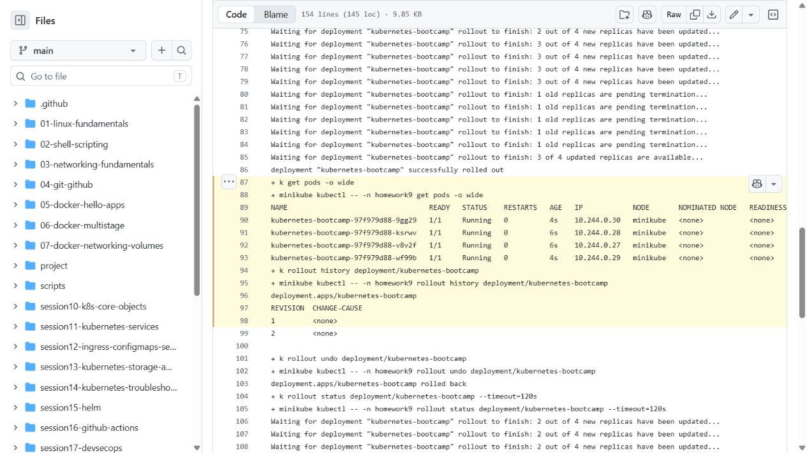

# Session 9 - Kubernetes Fundamentals

Name: Archit Kulkarni  
Roll number: 24BCS10194

## 1. CLI and Minikube setup

This lab uses `kubectl` to talk to the cluster and Minikube to create the local control-plane node.

```bash
minikube version
minikube kubectl -- version --client --output=yaml
minikube start --driver=docker
minikube status
minikube kubectl -- get nodes -o wide
minikube stop
```

`minikube start` creates the cluster, `status` confirms host/kubelet/API-server health, and `stop` releases the VM resources without deleting cluster configuration.

## 2. Cluster architecture

```text
kubectl / controllers
        |
  kube-apiserver <--> etcd
        |
 scheduler + controller-manager
        |
     worker node
  kubelet -> container runtime -> Pods
  kube-proxy -> Service networking
```

The control plane stores desired state in **etcd**. The **API server** is the only public control-plane entry point; the **scheduler** chooses a node for unscheduled pods, and controller managers continually reconcile actual state with desired state. On each worker, **kubelet** starts the assigned Pod through a CRI-compatible runtime, while **kube-proxy** programs Service traffic rules.

## 3. Verification sequence

Run the version, start, status, node, and stop commands above in that order. The same cluster can be used for the later Kubernetes exercises, then stopped after the lab work is finished.

## 4. Local cluster check

The local Minikube cluster was started with the Docker driver in Ubuntu WSL. The control plane and node check returned:

```text
Kubernetes control plane is running at https://127.0.0.1:32771
CoreDNS is running at https://127.0.0.1:32771/api/v1/namespaces/kube-system/services/kube-dns:dns/proxy

NAME       STATUS   ROLES           VERSION
minikube   Ready    control-plane   v1.37.0
```

The [full recheck](evidence/lab.txt), produced by [run-basics.sh](run-basics.sh), also deploys Nginx, exposes its Service, scales to four replicas, changes the image, checks rollout history, rolls back and verifies HTTP from inside the cluster. The temporary `homework9` namespace is then removed. WSL uses the Docker driver; `minikube kubectl --` keeps the CLI version matched to the cluster.


